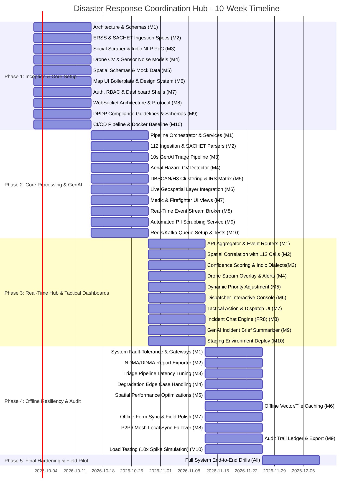

# 🚨 Disaster Response Coordination Hub (DRCH)

> **An AI-Powered, Multi-Modal Emergency Incident Triage, Clustering, and Dispatch Platform for the Indian Disaster Management Ecosystem (NDMA / IRS / ERSS 112).**

---

## 📌 Project Overview

The **Disaster Response Coordination Hub (DRCH)** is a unified mission-critical emergency coordination system designed to solve high-stress triage bottlenecks during localized and large-scale catastrophes. 

By ingesting real-time signals across **Social Media (in 22 scheduled Indian languages & Hinglish)**, **ERSS 112 Emergency Call Volume Spikes**, **Drone/UAV Aerial Reconnaissance**, and **NDMA SACHET XML CAP Early Warnings**, DRCH uses GenAI and spatiotemporal algorithms to:
1. **Filter noise & false alarms** from harsh weather sensor degradation or spam within 10 seconds.
2. **Deduplicate and cluster** multi-source reports into unified incidents (eliminating duplicate alerts for first responders).
3. **Assign dynamic priority scores** mapped directly to the **NDMA Incident Response System (IRS)** guidelines.
4. **Dispatch resources** via specialized role-based views (Field Medics, Firefighters, Logisticians) with interactive live GIS mapping, real-time tactical chat, and offline-first capabilities.

---

## 🏛️ System Architecture

```
                                  [ RAW DATA INGESTION FEEDS ]
      +-----------------------------------------+-----------------------------------------+
      |                                         |                                         |
[Social Media Feeds]                  [ERSS 112 Telecom/VPN]                     [Drone / SACHET]
 (22 Indic Langs + Hinglish)            (Call Spikes & Geo-Zones)             (Aerial Hazard / XML CAP)
      |                                         |                                         |
      v                                         v                                         v
 [Indic NLP & Text Extraction]       [ERSS Protocol & Rate Monitor]         [Sensor Weather Filter & CV]
      +-----------------------------------------+-----------------------------------------+
                                                |
                                                v
                              +-----------------------------------+
                              |   GenAI Fast Triage Engine (<10s) |
                              |   (Distress vs False Alarm Class) |
                              +-----------------------------------+
                                                |
                                     [If Distress Confirmed]
                                                v
                              +-----------------------------------+
                              | Spatiotemporal & Semantic Cluster |
                              | (DBSCAN / H3 Spatial Indexing)    |
                              +-----------------------------------+
                                                |
                                                v
                              +-----------------------------------+
                              |   IRS Dynamic Priority Engine     |
                              |   (NDMA Severity & Resource Matrix)|
                              +-----------------------------------+
                                                |
                                                v
                              +-----------------------------------+
                              | WebSocket / Real-time Event Hub   |
                              +-----------------------------------+
                                                |
            +-----------------------------------+-----------------------------------+
            |                                   |                                   |
            v                                   v                                   v
[Logistician / Dispatcher Map]         [Field Medic Portal]              [Firefighter Hazard Portal]
- Shared Live Map (Pins/Layers)        - Triage Vitals / Casualties      - Aerial Hazard & Wind Vectors
- Resource Queue & Assignment          - Route Navigation Alerts         - Environmental Hazard Data
- NDMA Escalation Controls             - Incident Chat                   - Incident Chat
            +-----------------------------------+-----------------------------------+
                                                |
                                                v
                              +-----------------------------------+
                              | Offline Mesh / IndexedDB Sync     |
                              | GenAI Incident Summary & Audit    |
                              +-----------------------------------+
```

---

## 👥 10-Member Team Roster & Ownership Matrix

| Member | Designated Role | Primary Modules & Responsibilities | Key FR / NFR Mapping |
| :--- | :--- | :--- | :--- |
| **Member 1** | **Team Lead & System Architect** | System architecture, API Gateway, core orchestrator, DB schemas, inter-service contracts. | Core Engine, DR4 |
| **Member 2** | **Gov & Telecom Ingestion Engineer** | C-DAC ERSS 112 VPN connector, SACHET XML CAP alerts ingestion, export engine. | FR2, FR10, FR11, DR2 |
| **Member 3** | **NLP & Indic GenAI Engineer** | Social media ingestion, 22 Indic languages + Hinglish parsing, 10s LLM triage prompt pipeline. | FR1, NFR1, DR3 |
| **Member 4** | **Computer Vision & Drone Engineer** | Drone stream ingestion, aerial hazard detection (fire/flood/debris), weather sensor noise filter. | FR3 |
| **Member 5** | **Geospatial & Clustering Engineer** | Geo-resolution, spatiotemporal clustering (DBSCAN/H3), NDMA/IRS dynamic priority scoring. | FR4, FR5, DR1 |
| **Member 6** | **Frontend Lead & GIS Map Engineer** | Interactive live map UI (Leaflet/Mapbox), incident pins, clustering visuals, offline tile cache. | FR6, NFR5 |
| **Member 7** | **Frontend Engineer (Role Portals)** | Role-based dashboards (Medic, Firefighter, Logistician), RBAC guards, responsive tactical UI. | FR7, NFR4 |
| **Member 8** | **Real-Time & Mesh Sync Engineer** | WebSockets/Socket.io event bus, incident chat, offline local storage & P2P/mesh sync fallback. | FR8, NFR5 |
| **Member 9** | **GenAI Summarizer & Compliance Officer** | GenAI incident debrief generation, DPDP Act 2023 PII redaction/anonymization, DDMA audit logs. | FR9, FR11, DR3 |
| **Member 10** | **DevOps, SRE & QA Lead** | MeitY cloud setup, Docker/K8s, Redis/Kafka broker, 10x spike load testing, 99.9% HA monitoring. | NFR2, NFR3, DR4 |

---

## 📅 Phase-Wise Implementation Roadmap (5 Phases / 10 Weeks)



---

## 📋 Granular Phase-Wise Work Allocation for All 10 Members

### Phase 1: Foundation, Schemas, Prototypes & Environment Setup (Weeks 1 - 2)
*Goal: Establish system contracts, development environments, baseline microservices, and ingestion schemas.*

- **Member 1 (Architect)**: 
  - Design system architecture, service dependency graph, and OpenAPI/REST specification.
  - Setup core repository, database migration templates (PostgreSQL/PostGIS), and shared data models (`Incident`, `Alert`, `TriageResult`, `UserRole`).
- **Member 2 (Gov/Telecom)**:
  - Document C-DAC ERSS 112 API/VPN simulation specifications and mock data generator.
  - Implement parser prototype for NDMA SACHET XML Common Alerting Protocol (CAP) schema.
- **Member 3 (Indic NLP & GenAI)**:
  - Setup social media ingestion connectors (Twitter/X API v2 mock, Telegram distress bot, WhatsApp Business webhook sandbox).
  - Benchmark Indic-BERT / multilingual LLM models on Hindi, Marathi, Bengali, Tamil, Telugu, and Hinglish sample posts.
- **Member 4 (Drone CV)**:
  - Collect and curate drone footage dataset with simulated weather degradation (fog, downpour, heavy smoke).
  - Research sensor degradation profiles (MPU6050 IMU drift and VL53L5CX ToF sensor noise filters under water droplets).
- **Member 5 (Geospatial)**:
  - Define PostGIS geospatial indexes, H3 hexagonal hierarchical spatial indexes (resolutions 7-9).
  - Formulate NDMA Incident Response System (IRS) severity matrix rules (Scale 1–5 based on life risk, critical infrastructure impact, and environmental hazard).
- **Member 6 (GIS Map UI)**:
  - Initialize React / Next.js GIS frontend application with TailwindCSS/Vanilla CSS design system.
  - Integrate Leaflet/Mapbox GL JS with custom dark tactical base maps and mock incident markers.
- **Member 7 (Role Dashboards)**:
  - Build role-based routing architecture (JWT authentication, role guards: `MEDIC`, `FIREFIGHTER`, `LOGISTICIAN`, `ADMIN`).
  - Create wireframes and component scaffolding for Medic (casualties focus) and Firefighter (hazards focus) dashboards.
- **Member 8 (Real-Time & Sync)**:
  - Setup WebSocket server infrastructure using Socket.io / Stomp with Redis Pub/Sub adapter.
  - Create message envelope schema (`INCIDENT_NEW`, `STATUS_UPDATE`, `CHAT_MESSAGE`, `GEO_LOCATION_PING`).
- **Member 9 (Compliance & Summarizer)**:
  - Create DPDP Act 2023 compliance matrix for PII scrubbing (phone numbers, Aadhaar, names, personal photos).
  - Draft few-shot prompt templates for automated multi-source incident aggregation summaries.
- **Member 10 (DevOps & QA)**:
  - Configure Docker Compose for local development (Backend, Postgres/PostGIS, Redis, Kafka/RabbitMQ).
  - Set up GitHub Actions CI for linting, unit test validation, and build verification.

---

### Phase 2: Ingestion Pipelines, GenAI Triage & Clustering Engine (Weeks 3 - 4)
*Goal: Functional automated triage pipeline from raw ingest to clustered, prioritized incidents.*

- **Member 1 (Architect)**:
  - Implement the Central Pipeline Orchestrator linking ingestion adapters to the Triage & Clustering engines.
  - Implement rate limiting, circuit breakers, and dead-letter queues for resilient data flow.
- **Member 2 (Gov/Telecom)**:
  - Finalize SACHET XML CAP polling worker (every 60s) with coordinate polygon extraction for cyclone/flood zones.
  - Build ERSS 112 mock streaming server simulating realistic call volume spikes correlated by district/zone.
- **Member 3 (Indic NLP & GenAI)**:
  - Build the GenAI Triage Pipeline: Distress classification + NER (extracting location landmarks, trapped count, medical urgency).
  - Optimize inference time with prompt compression, local quantized models (e.g., Llama-3/Mistral/IndicLLM) to guarantee **< 10 second latency (NFR1)**.
- **Member 4 (Drone CV)**:
  - Train and deploy YOLOv8/v9 object detection model for aerial disaster cues: active flames, flood water coverage, collapsed structural debris.
  - Implement temporal verification filter (cross-checking multi-frame detections to reject rain/smoke sensor artifacts).
- **Member 5 (Geospatial)**:
  - Implement Spatiotemporal Clustering: DBSCAN on spatio-temporal distance + cosine similarity on NLP embeddings to group duplicate reports into single incidents (FR4).
  - Implement initial IRS Priority Scoring engine calculating `PriorityScore = f(Severity, Casualties, Infrastructure, WeatherAlert)`.
- **Member 6 (GIS Map UI)**:
  - Render dynamic clusters on the Dispatcher map with color-coded severity rings (Red: Critical, Orange: High, Yellow: Moderate, Green: Low).
  - Implement interactive incident drawer displaying clustered source evidence (social posts, 112 calls, drone photos).
- **Member 7 (Role Dashboards)**:
  - Implement **Field Medic Dashboard**: Triage counter, casualty severity tags (Red/Yellow/Green/Black), nearest hospital routing overlay.
  - Implement **Firefighter Dashboard**: Structural hazard badges, water supply proximity indicator, wind direction indicator.
- **Member 8 (Real-Time & Sync)**:
  - Connect frontend components to WebSocket broker for zero-refresh incident updates.
  - Build incident room join/leave logic for real-time responder positioning and state broadcast.
- **Member 9 (Compliance & Summarizer)**:
  - Build automated PII sanitization pipeline (masking names, phone numbers, face blurring in social imagery) before DB storage.
  - Validate output schemas for GenAI summary outputs.
- **Member 10 (DevOps & QA)**:
  - Setup Apache Kafka / RabbitMQ message queues between ingestion scrapers and the GenAI worker pool.
  - Write automated end-to-end integration tests for the ingestion-to-clustering pipeline.

---

### Phase 3: Tactical Dispatch, Real-Time Chat & Multi-Source Intelligence (Weeks 5 - 6)
*Goal: Complete first-responder dispatch loop, real-time collaboration, and actionable situational awareness.*

- **Member 1 (Architect)**:
  - Build the Resource Allocation & Assignment Engine: Unit dispatch state machine (`PENDING` -> `ASSIGNED` -> `ACKNOWLEDGED` -> `EN_ROUTE` -> `ON_SCENE` -> `RESOLVED`).
  - Implement API endpoints for cross-agency escalation to NDMA / State Disaster Management Authorities.
- **Member 2 (Gov/Telecom)**:
  - Implement automated correlation algorithm joining ERSS 112 call volume density spikes with social media distress clusters.
  - Implement CAP alert geo-fencing (flagging active responders entering red weather alert polygons).
- **Member 3 (Indic NLP & GenAI)**:
  - Add confidence scoring to Indic language triage, flagging low-confidence alerts for human dispatcher verification.
  - Implement multi-lingual transliteration support (e.g., Devanagari to Latin and vice-versa) for Indian landmark recognition.
- **Member 4 (Drone CV)**:
  - Connect drone camera RTSP/HLS live feed playback with bounding box hazard overlays directly in the dashboard.
  - Integrate DGCA Digital Sky airspace boundary geo-fence verification (warning operators of Yellow/Red zone clearances).
- **Member 5 (Geospatial)**:
  - Dynamic Priority Re-scoring: Increase incident priority automatically if multiple 112 calls or drone hazard detections occur within 15 minutes.
  - Implement shortest safe path computation (avoiding flooded roads and blocked zones using OpenStreetMap Overpass API).
- **Member 6 (GIS Map UI)**:
  - Build Dispatcher Action Center: 1-click team allocation, dispatch queue, responder location tracking pins.
  - Add map layer filters: Toggle Weather Radar, 112 Density Heatmap, Drone Inspection Zones, Active Responders.
- **Member 7 (Role Dashboards)**:
  - Build **Logistician / IRS General Staff Dashboard**: High-level resource utilization gauges (ambulances, fire tenders, rescue boats, food packets).
  - Add dispatch acknowledgment modal and audio-visual sirens for high-priority incoming alerts.
- **Member 8 (Real-Time & Sync)**:
  - Implement **Incident-Scoped Real-Time Chat (FR8)**: Responders assigned to an incident can exchange text, quick status chips, and situational photos.
  - Implement read receipts, offline message queuing, and priority broadcast alerts.
- **Member 9 (Compliance & Summarizer)**:
  - Implement **GenAI Auto-Summarizer (FR9)**: Generates concise 3-sentence operational summaries (`Situation`, `Casualties/Risks`, `Action Taken`) updated live as new alerts attach to an incident.
- **Member 10 (DevOps & QA)**:
  - Deploy staging environment on MeitY-empaneled cloud infrastructure (e.g., NIC / AWS Asia-Pacific Mumbai / Azure India Central).
  - Conduct security audit for OWASP Top 10 API vulnerabilities and RBAC leakage.

---

### Phase 4: Offline-First Mesh Resiliency, Auditing & Performance Optimization (Weeks 7 - 8)
*Goal: Guarantee field survival under telecom blackout, audit readiness, and sub-10s GenAI performance.*

- **Member 1 (Architect)**:
  - Implement data conflict resolution strategies (CRDTs / Last-Write-Wins) for synchronizing field data after offline reconnects.
  - Complete disaster event archiving and state compaction pipelines.
- **Member 2 (Gov/Telecom)**:
  - Implement **DDMA/NDMA Official Audit Export Module (FR11)**: Generate standardized post-incident disaster reports in PDF, GeoJSON, and CSV formats conforming to NDMA guidelines.
- **Member 3 (Indic NLP & GenAI)**:
  - Fine-tune and benchmark the GenAI triage pipeline to ensure **under 10-second processing time (NFR1)** under continuous batch ingestion.
- **Member 4 (Drone CV)**:
  - Optimize computer vision inference pipeline using TensorRT / ONNX Runtime to support edge inference on low-power drone base stations (Jetson Nano/Orin).
- **Member 5 (Geospatial)**:
  - Benchmark and index PostGIS database with GiST and spatial partition tables for sub-50ms query response on 100,000+ spatial points.
- **Member 6 (GIS Map UI)**:
  - Implement **Offline Map Caching (NFR5)**: Progressive Web App (PWA) with Service Worker caching of vector map tiles (MBTiles) for targeted district zones.
- **Member 7 (Role Dashboards)**:
  - Enable offline caching in Medic & Firefighter dashboards using IndexedDB; allow responders to log field vitals/status while disconnected.
- **Member 8 (Real-Time & Sync)**:
  - Implement local P2P/mesh sync fallback (WebRTC DataChannels / Wi-Fi Direct simulation) allowing nearby field devices to exchange chat & triage data when cellular towers fail.
- **Member 9 (Compliance & Summarizer)**:
  - Build tamper-evident incident audit trail ledger (recording every dispatcher decision, timestamp, and AI triage confidence score).
  - Implement DPDP Act 2023 data retention and anonymization routines for closed incident logs.
- **Member 10 (DevOps & QA)**:
  - Execute **10x Load Spike Stress Tests (NFR3)** using k6 / Locust, simulating sudden disaster surges (10,000 requests/sec).
  - Verify **99.9% High Availability (NFR2)** with automated failover and health check probes.

---

### Phase 5: Integration Drills, Field Acceptance & Project Delivery (Weeks 9 - 10)
*Goal: Simulated multi-agency disaster drills, bug bashes, final documentation, and project handover.*

- **Member 1 (Architect)**: Oversee end-to-end integration test drills, conduct code reviews, and deliver final technical architecture documentation.
- **Member 2 (Gov/Telecom)**: Validate ERSS 112 mock telemetry and SACHET CAP feeds against realistic mock cyclone/flood disaster scenarios.
- **Member 3 (Indic NLP & GenAI)**: Validate triage accuracy on 500+ multi-dialect test samples (including mixed code Hinglish) with >92% F1-score.
- **Member 4 (Drone CV)**: Validate false-positive rejection rates during heavy simulated smoke/rain conditions.
- **Member 5 (Geospatial)**: Verify cluster deduplication accuracy across 1,000 concurrent mock distress points within a 5km radius.
- **Member 6 (GIS Map UI)**: Polish UX micro-interactions, responsive mobile/tablet breakpoints, and visual contrast for bright outdoor field usage.
- **Member 7 (Role Dashboards)**: Complete accessibility (WCAG 2.1 AA) and rapid-click ergonomic testing for stressed field workers with gloves.
- **Member 8 (Real-Time & Sync)**: Conduct simulated telecom blackout drill: verify offline queueing, local sync, and smooth reconnection to central server.
- **Member 9 (Compliance & Summarizer)**: Generate comprehensive executive incident briefing sample reports and verify 100% PII redaction compliance.
- **Member 10 (DevOps & QA)**: Finalize production deployment manifests (Kubernetes Helm charts / Terraform), automated backup policies, and disaster recovery runbooks.

---

## 🛠️ Technology Stack Recommendations

| Tier | Technologies |
| :--- | :--- |
| **Frontend & PWA** | Next.js / React 18, Leaflet / Mapbox GL JS, TailwindCSS, Service Workers, IndexedDB |
| **Backend & APIs** | Node.js (TypeScript) / Python (FastAPI), RESTful API, WebSocket (Socket.io) |
| **Database & GIS** | PostgreSQL 16 with **PostGIS 3.4**, Redis (Caching & Pub/Sub), Uber H3 Spatial Index |
| **AI / Machine Learning** | Multilingual Indic-LLM / Llama-3 (vLLM / Ollama), YOLOv8/v9 (PyTorch/ONNX), LangChain |
| **Data Ingestion** | Apache Kafka / RabbitMQ, XML-to-JSON CAP Parser, Webhook Adapters |
| **DevOps & Infra** | Docker, Kubernetes, Nginx / Traefik, GitHub Actions CI/CD, Prometheus & Grafana |
| **Compliance & Security** | OAuth 2.0 / JWT, MeitY-empaneled Cloud (AWS Mumbai / Azure India), DPDP PII Sanitizer |

---

## 🚀 Quick Start Guide (Local Development Setup)

### Prerequisites
- [Docker & Docker Compose](https://www.docker.com/) installed
- [Node.js (v18+)](https://nodejs.org/) & [Python (v3.10+)](https://python.org/)
- Git

### 1. Clone the Repository
```bash
git clone https://github.com/Siddhcreator-1706/IT314_Software_Project.git
cd IT314_Software_Project
```

### 2. Configure Environment Variables
```bash
cp .env.example .env
# Edit .env with your LLM API keys, DB credentials, and mock ports
```

### 3. Launch the Entire Platform (Docker)
Since the project is fully containerized, you can launch the Next.js frontend, FastAPI backend, Python AI workers, and all core infrastructure (PostgreSQL, Redis, RabbitMQ) with a single command:

```bash
docker compose up --build
```

### 4. Access the Applications
Once the containers are running, you can access the different parts of the system:
- **Frontend (Web Client & Portals):** `http://localhost:3000`
- **Backend API Docs (Swagger UI):** `http://localhost:8000/docs`
- **RabbitMQ Admin UI:** `http://localhost:15672` (guest/guest)

Open `http://localhost:3000` to access the DRCH platform.

---

## 🤝 Contributing to DRCH

We welcome contributions from all 10 team members! To keep our codebase clean and organized, please follow these guidelines:

1. **How to Decide What to Work On:**
   - Cross-reference the **Team Roster** and **Phase-wise Roadmap** above.
   - Find an unassigned GitHub Issue matching your phase/role and assign it to yourself.
2. **Branching Strategy:**
   - Never commit directly to `main`. 
   - Create a new branch: `feature/<module>-<description>` (e.g., `feature/medic-dashboard`) or `bugfix/<description>`.
3. **Commit Messages:**
   - Follow [Conventional Commits](https://www.conventionalcommits.org/en/v1.0.0/) format (e.g., `feat(frontend): add map pins`, `fix(backend): resolve db crash`).
4. **Submitting a Pull Request (PR):**
   - Push your branch, open a PR against `main`, and link the Issue it resolves.
   - Request a code review from the Team Lead or a peer. Once approved and CI passes, it will be merged.

---

## 🔒 Compliance & Standards

- **NDMA / IRS Guidelines**: Incident categorization, resource management, and command chain mapping.
- **DPDP Act 2023**: Strict data minimization, on-the-fly PII scrubbing, and right-to-forget compliance for citizen distress data.
- **C-DAC ERSS 112 Norms**: Encrypted transport, RBAC audit trails, and strict data isolation for telecom metadata.
- **MeitY Guidelines**: Strict hosting within certified sovereign data centers on Indian soil.

---

## 📜 License

This project is licensed under the **Apache License 2.0** - see the `LICENSE` file for details.
